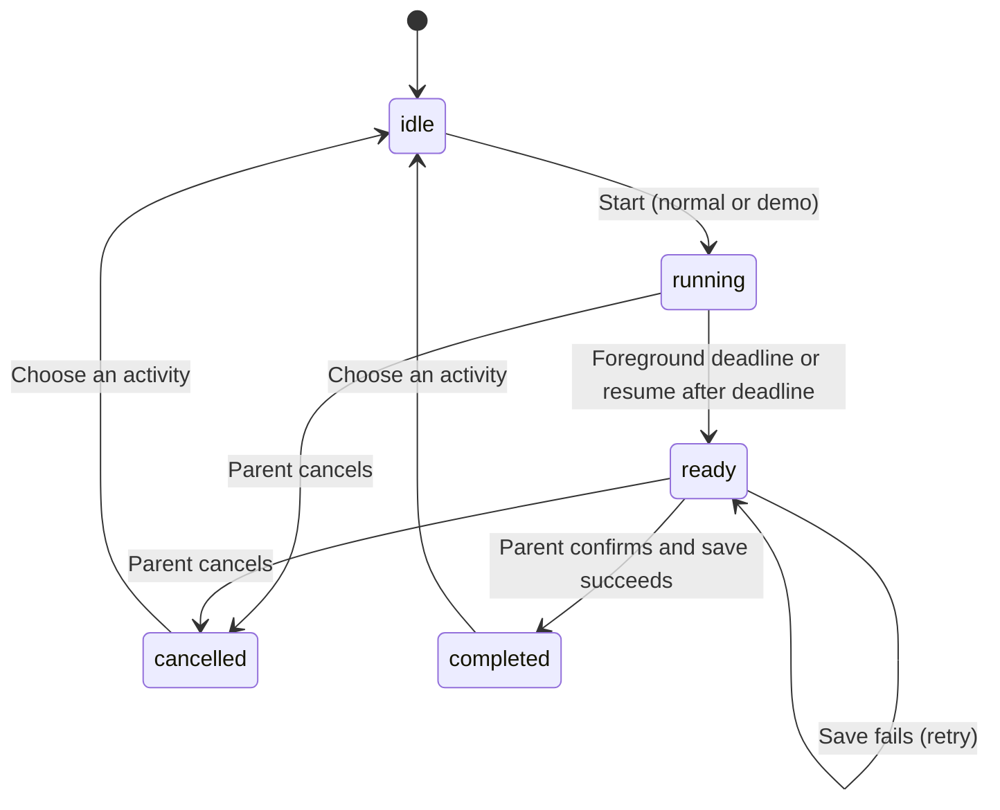
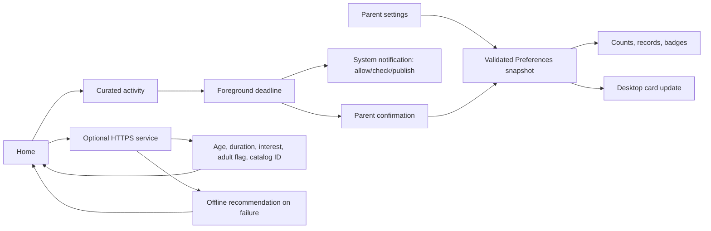

# Architecture

## Parent work-session layer

Home, Activities and the existing Progress/Parent views share four bottom tabs. Index adds work setup, parent status, summary and a reduced child-facing activity state. Existing single-activity state machine, source selection, timer, notification and parent-confirmation paths remain the execution layer.

`model/WorkSession.ets` owns deterministic category scheduling, validated checkpoint data, skip/end transitions and summary totals. `services/WorkStore.ets` stores a separate bounded Preferences checkpoint, so corrupt work data cannot erase the existing history. ParentSettings adds preferred types, work-window minutes, difficulty and safety preferences; old snapshots receive defaults before validation. Age groups represent childAge; interests and quick-activity minutes retain their existing fields.

Flow: parent profile -> work duration/source preference -> short category plan -> review and optional content preparation -> child activity -> parent confirmation -> existing LocalStore journal -> next activity or summary. Stable work ID + entry index protects history against retries after restart. Demo activity minutes are excluded from category summary totals. Skip/end never fabricate completions. Checkpoints retain remaining seconds/step/demo and restart in a paused Built-in state; media and live jobs are deliberately reviewed again. Only the latest work session/summary is retained.

Original SVGs in entry/rawfile form a semantic MOVE/LEARN/CREATE/CALM illustration system; the hero shows a working parent and a child indoors. The existing fallback MP4 is copied unchanged into Phone for offline native Video playback. No new UI framework is used.

Content origin is shared enum ActivityContentSource. VideoSource carries source/URI/title/activity/provider from Phone to Large Screen; private paths stay on Phone. Provider-independent ActivityJobs retains common validation, retry, review/cache and fallbacks for Gemini and Huawei adapters. System-imported My Video stores one MP4 privately plus Preferences metadata, optionally publishes it to the loopback cache for separate-Large Screen playback, and uses the same session/confirmation/history flow. Old records without source default to Built-in. See AI_ARCHITECTURE.md for exact cloud contracts and verification limits.

With all four preferred types, the thirty-minute plan is MOVE, LEARN, LEARN, CREATE, CREATE, CALM (six five-minute entries). Other durations or restricted type selections retain short cyclic plans. Unsupported requested work durations safely normalize to thirty minutes. The setup renders planned category totals before starting.

## Integrated system

`entry` remains Phone controller/storage owner. `tventry` is an independent Large Screen entry HAP with minimum API 21. `shared` is a local protocol/HTTP HAR. `backend` handles activity jobs, provider calls, local media cache and transient relay rooms. Phone snapshots control playback; only parent-confirmed Phone storage updates counts. See [Large Screen](TV_MODE.md), [protocol](TV_PROTOCOL.md), [backend/AI](AI_ARCHITECTURE.md). Earlier core details below describe preserved Phone behavior.

## Native structure

CompanionOS uses the existing HarmonyOS Stage-mode `entry` Phone module and ArkUI V1 state components, targeting/compatible with API 21. `EntryAbility` loads `pages/Index` and publishes foreground state through AppStorage. Home, Settings, Activity, Progress, Large Screen Connection and the landscape local Large Screen Player are clear states in one entry page; there is no Flutter or web runtime. The phone owns the session; a transport projects frames into the local Large Screen view. The real distributed channel remains an extension point. See [Large Screen architecture](TV_MODE.md) and [AI architecture](AI_ARCHITECTURE.md).

| Module | Responsibility |
|---|---|
| `model/Companion.ets` | Curated catalog, settings and completion schema, snapshot validation, counts and session transitions |
| `services/LocalStore.ets` | Preferences load/save, old homepage migration and recovery |
| `pages/Index.ets` | Home, Parent Settings, Activity, Progress and guarded user actions |
| `services/Notifications.ets` | Permission request/check and basic system notification submission |
| `services/AiService.ets` | Optional HTTPS recommendation request, validation and offline fallback |
| `services/Widgets.ets` | Widget data, known form IDs and best-effort pushes |
| `widget/TodayFormAbility.ets` | Form lifecycle, fresh local snapshot reads and scheduled refresh |
| `widget/pages/TodayCard.ets` | 2×2 card showing suggested activity, today's count, data date and app launch link |

## Activity state machine

Normal mode freezes the selected 3/5/10 minutes at session start; Demo Mode uses ten seconds and marks its record. A synchronous busy guard blocks concurrent confirmations. The session phase must be `ready`, the parent must check the confirmation box, and the snapshot deduplicates session IDs. No completion is added on cancellation, mere timer expiry, leaving or process termination.

## Data and failure handling

The Preferences file `companion_history` stores a single `mvp` JSON snapshot: schema version, settings, latest 20 records, total count, local calendar-day key and daily count. Snapshot writes are flushed before success appears in the UI. A failed flush leaves the UI ready to retry; session ID deduplication prevents another successful count for that session. Preferences failure/durability semantics still require device testing.

Settings are edited as a separate draft. Saves are validated and applied together; controls are disabled during save. Missing data starts with defaults. Invalid JSON/schema recovers safely with a notice. Valid previous homepage records/counts are imported without deleting old keys. Older history discarded by the original implementation cannot be reconstructed.

The session is intentionally not persisted. Timers exist only for foreground UI updates. AppStorage foreground changes stop/restart the interval; resume calculates time from a saved deadline. Background-expired sessions do not produce a retroactive notification. Changes to the device wall clock may affect countdowns. Widget callbacks are scheduled by the OS and are not background alarms.

## Platform and AI flow

Notification rejection or failure changes messaging, not completion eligibility. Publishing is checked against the still-active foreground session. Widget pushes are best effort and failure-isolated. The form registration profile and LocalStorage bindings are compiled into the HAP.

The original catalog-recommendation adapter is separate from the current backend activity/video pipeline. See AI_ARCHITECTURE.md for the implemented optional backend. The client sends only age group, interests, duration and allowed catalog IDs after explicit parent request. It never renders arbitrary server-generated activity instructions. Provider secrets must remain on a separately operated backend; see `AI_SERVICE.md`.
