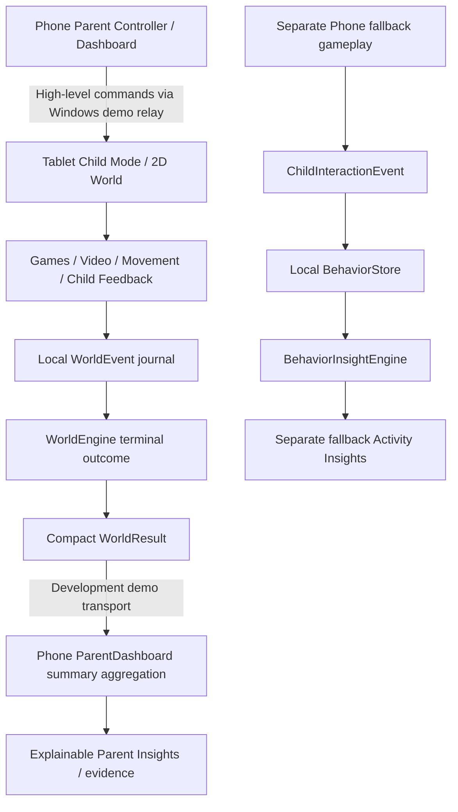

# Actual architecture

CompanionOS separates the child and parent experiences across HarmonyOS devices. The Tablet provides an engaging interactive world for the child, while the Phone acts as the parent's control and insight dashboard.

## Native modules

| Module | Role | Existing target |
|---|---|---|
| entry | ParentDashboard plus retained Index Phone fallback and provider review | Phone / default / API 21 |
| tventry | ChildWorld local authority plus retained TvHome video receiver | Tablet / tablet / API 21 |
| shared | WorldEngine, game metadata/protocol/HTTP, original fallback GameEngine/GameBoard | Native HAR |
| backend | Existing provider adapters, review/import/video serving and demo relays | Windows Node >=22 |

`ChildWorldModel.ets` is a pure transition model. `ChildWorld.ets` renders interactive native Stack scenes, SVG objects, pan gestures, ambient/Pico animations and Video. WorldStore owns the bounded raw journal and world progress. ParentWorldStore owns compact results/configuration. SessionBalanceEngine supplies every remote session's category/minute/mode allocation. The Tablet story adapter splits longer interactive LEARN slots into two short missions (for example bridge then memory), without changing any category or video minutes. Parent Custom percentage controls and 2-5 signals are independently persisted. Invalid optional Custom data falls back safely without discarding valid history. Recommendations may change an interactive LEARN mission, never its protected category allocation or video allowance.

## Compact child-world synchronization

Phone sends validated commands to POST `/world/rooms/family-demo/command`. Tablet POSTs `{status, results}` to `/world/rooms/family-demo/tablet` once per foreground second and receives queued commands. Phone GETs `/world/rooms/family-demo/phone` approximately every 1.5 seconds while the dashboard is mounted.

Commands: ENTER_CHILD_MODE, EXIT_CHILD_MODE, START_SESSION, PAUSE_SESSION, RESUME_SESSION, NEXT_ACTIVITY, END_SESSION. Tablet acknowledgement is its subsequent status; a successful POST alone does not prove execution. A persistent bounded handled-ID journal prevents replay. Completed results use stable mission IDs; relay and Phone deduplicate them. Optional feedback can update the same terminal result without increasing counts. Queues/results are bounded and ephemeral in Windows memory; Tablet re-sends its local summaries after relay restart.

Status covers Child Mode, mission/world/style, phase, session foreground budget and completed/total. Raw object/sequence events are never part of this payload. Both emulator guests use 10.0.2.2:18080; the Windows server listens on loopback. No HDC reverse tunnel, cloud relay, OS kiosk or production distributed-device implementation is claimed. There is no network authentication/encryption on this loopback-only development setup; do not expose it as a production service.

## Local authority and recovery

Tablet executes gameplay immediately, without a Phone round trip per tap. It can finish the current safe mission while Phone or relay is unavailable. It retains results for reconnect. Backgrounding pauses the world and video; timers do not assume continuous background execution. Restoration of an active session is safely paused; resuming a memory preview replays the signals. An explicit parent pause blocks game changes. A disconnected saved adventure can be resumed locally using the visible recovery control.

WorldStore, ParentWorldStore, BehaviorStore, JourneyStore and expanded Phone LocalStore split JSON below the installed Preferences value limit. The inactive bank is flushed before the bank pointer is published. Missing or invalid data returns safe defaults; failed writes are visible. Tablet keeps <=1000 raw events, <=300 compact outcomes and <=1000 rewarded dates; Phone keeps <=300 Tablet outcomes. These are bounded local journals, not permanent cloud histories. Phone fallback retains its separate legacy completion journal/cumulative counters.

## Video and retained services

Existing `/tv/rooms/...` protocol and transport remain for Phone fallback/native reviewed-video projection. Its legacy interactive GameBoard path still sends validated input commands to Phone; **the primary ChildWorld never uses that per-input route**. ChildWorld owns raw inputs locally and sends only summaries through `/world/...`.

Reviewed Gemini/Huawei/imported video URIs can be projected through the existing content flow and opened from the storybook. With no reviewed URI, original local counting/cloud clips keep WATCH available. Native completion returns to the scene. Early return is a skipped video, not a completed playback. Keys remain backend environment variables; no raw behavior log is included in provider requests. Actual authenticated generation remains unverified.

Existing notifications use real NotificationKit authorization/publish for Phone foreground expiry and do not guarantee background delivery. FormKit widget code remains; hosting has not been verified. Local child summaries do not pretend to be parent-confirmed Phone completions and do not silently inflate that widget/journal.

## Insights and privacy

ParentDashboard aggregates actual summaries by BUILDING, MEMORY, SORTING, COUNTING, EXPLORING, CREATING, MOVEMENT and WATCHING. Evidence exposes per-mission outcome, attempts, retries, duration and optional feedback. Preference recommendations require at least three recent outcomes of the relevant game and explicit feedback weighting. Repeated explicit tricky memory feedback can reduce sequence length to two. No diagnostic/ability/personality inference occurs.

BehaviorInsightEngine remains the Phone fallback's descriptive raw-event engine with Today/7/30-day windows and sample safeguards. The two data sources are labelled rather than falsely treating remote summaries as individually observed raw answer events. Adult supervision and safety constraints apply to both.

## Explicit insight data flows

The conceptual interaction-to-insight pipeline has two actual implementations. Tablet raw events are `WorldEvent`, not falsely renamed `ChildInteractionEvent`, and they are not shipped into BehaviorInsightEngine. ParentDashboard aggregates the actual compact WorldResult summaries; BehaviorInsightEngine consumes local Phone fallback ChildInteractionEvent records. Retaining this distinction preserves state ownership, event semantics and existing history. Both expose descriptive evidence; neither performs diagnosis.

The four Phone root views now group Home status/contextual actions, Activities content, Insights evidence/history and Parent advanced/profile/technical configuration. Legacy internal routes remain reachable. Read PARENT_PHONE_UI.md for exact state/action precedence. Production authentication/encryption, widget hosting and background scheduling are not added by this documentation audit.

## Local parent summary pipeline

ParentWorldStore compact outcomes → ParentInsightSummaryEngine validated/deduplicated time window → transient mission-ID metric adapter → existing BehaviorInsightEngine.metrics → bounded deterministic summary → ParentDashboard Home/Insights → expandable evidence. No synthetic adapter events are written to BehaviorStore. The independent Phone fallback event pipeline remains intact.

Summary generation is a read-only local operation. It makes no HTTP/provider calls and never changes outcomes, completion counts, session state, saved configuration or balanced slots. Insights uses summary-first layout, Today/7/30 windows, one optional balanced suggestion, evidence toggle and optional detailed metrics. Home uses exactly one seven-day summary sentence. Rules and input limitations are documented in ACTIVITY_INSIGHTS.md.

## Bounded interactive Storybook

The existing watch game uses its existing WorldState phase/progress/selected fields. Native Video still plays the existing cloud asset or a selected reviewed URI. Its finish callback dispatches video-ended: watch → input, preserving paused status if video end and pause coincide. Three validated story-step placements then reach success. Return to World invokes existing WorldEngine.next, which records one stable mission ID and follows existing hub/Daily slot/ending logic. Skip invokes existing skipped-outcome handling. No relay/Phone/session-allocation/persistence schema change is required.

Only VIDEO_STARTED, VIDEO_COMPLETED, existing MISSION_STARTED, drag starts, successful OBJECT_PLACED and completed/skipped outcome logs are needed; tap arming and gentle misses generate no per-touch event, attempt or retry score. Raw events stay Tablet-local; Phone receives the same compact WATCHING result. Foreground duration includes both video and the brief interaction and is descriptive, not a psychological measurement. Calm Sky and other worlds are unchanged.
